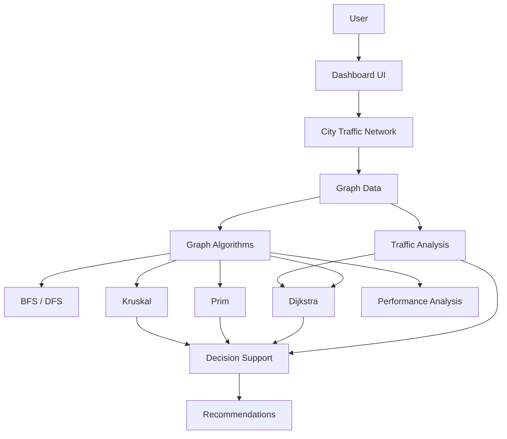

# Smart City Traffic Management and Route Optimization System

## A graph-algorithm-driven decision-support system for intelligent urban traffic and infrastructure planning.

## Project Overview

This project models a city's transportation network as a weighted, undirected graph. Intersections are vertices, roads are edges, and physical road distance is the base edge weight. Simulated traffic conditions and traffic multipliers modify routing cost for traffic-aware fastest-route calculations.

The system combines graph algorithms, traffic analysis, infrastructure planning, performance measurement, interactive visualization, and deterministic decision support in a client-side dashboard. It does not use live traffic data. All traffic conditions in the current implementation are simulated project data stored in the graph.

## Problem Statement

Route selection based only on physical distance does not always reflect congestion. A slightly longer road network path may be more efficient when the shorter path contains moderate or heavy traffic. City planners also need a way to inspect network structure, identify congested roads, and plan a connected infrastructure network without unnecessary cycles.

This system addresses network traversal, shortest-path routing, traffic-aware routing, infrastructure planning, congestion analysis, algorithm performance analysis, commuter decision support, and administrator decision support.

## Objectives

1. Model a city transportation network as a graph.
2. Implement BFS and DFS traversal.
3. Implement Dijkstra shortest-path routing.
4. Support traffic-aware route optimization.
5. Implement Prim and Kruskal minimum spanning tree algorithms.
6. Analyze traffic and congestion.
7. Benchmark algorithm execution in the browser.
8. Generate commuter recommendations.
9. Generate infrastructure recommendations.
10. Provide an interactive visualization.

## Technology Stack

| Technology | Use |
| --- | --- |
| Next.js 16 | React application framework and App Router |
| React 19 | Interactive dashboard components and state management |
| TypeScript | Typed graph models, algorithms, and UI contracts |
| Tailwind CSS 4 | CSS processing through the Tailwind PostCSS plugin |
| CSS and SVG | Dashboard styling and city-road visualization |
| Next Font | Geist typography loaded through `next/font` |
| Git and GitHub | Version control and feature-branch workflow |
| Vercel | Deployment target for the Next.js application |

The application has no backend, database, external traffic API, or additional runtime dependency for graph processing.

## System Architecture



`data/trafficGraph.ts` is the shared graph source. `types/trafficGraph.ts` defines the graph contracts. The interactive client dashboard calls the reusable algorithm modules and passes their results to the visualization and decision-support components. Performance Analysis measures the existing implementations locally with `performance.now()`.

## Graph Model

The current sample network contains **11 intersections** and **16 roads**.

| Element | Meaning |
| --- | --- |
| Vertex | An intersection in the city network |
| Edge | An undirected road connecting two intersections |
| Base weight | Physical road distance in kilometres |
| Traffic condition | `normal`, `moderate`, or `heavy` |
| Traffic multiplier | Existing road value used by fastest-route Dijkstra |

Roads are traversable in both directions. The graph is maintained in [`data/trafficGraph.ts`](data/trafficGraph.ts), while the TypeScript model is in [`types/trafficGraph.ts`](types/trafficGraph.ts). MST calculations use physical distance only. Dijkstra uses physical distance for shortest-distance routing and `distance × trafficMultiplier` for fastest routing.

## Algorithms

### BFS

Breadth-first search performs unweighted network traversal level by level. It is used by the Graph Traversal section to explore the network from a selected start node.

- Time: `O(V + E)` for the intended adjacency-list traversal model.
- Space: `O(V)`.

### DFS

Depth-first search explores one branch deeply before backtracking. It is also used by the Graph Traversal section.

- Time: `O(V + E)` for the intended adjacency-list traversal model.
- Space: `O(V)`.

The current traversal helper scans the shared edge list when discovering neighbors, while preserving these standard graph-traversal characteristics for this project graph.

### Dijkstra

Dijkstra computes a non-negative weighted shortest path and reconstructs the selected node path.

- Shortest distance: edge cost is the physical road distance.
- Fastest route: edge cost is physical road distance multiplied by the existing traffic multiplier.
- Uses a binary min-heap and stops when the destination is finalized.
- Space: `O(V)` for distance, predecessor, finalized-node, and queue state.

The standard min-heap adjacency-list form is commonly described as `O((V + E) log V)`. The current implementation iterates through the complete edge list for each finalized node, so its literal worst-case bound is `O(VE + E log V)`. This documentation records the implementation as it exists rather than claiming an adjacency-list optimization that is not present.

### Prim

Prim grows a minimum spanning tree from the first graph node, repeatedly selecting the least-distance edge that expands the connected set. The implementation uses a binary min-heap of candidate edges and physical road distance.

- Time: `O(E log E)` for the current edge-list candidate heap implementation.
- Space: `O(V + E)`.

### Kruskal

Kruskal sorts roads by physical distance and uses a disjoint-set union structure with path compression and union by rank. An edge is added only when it joins two different components.

- Time: `O(E log E)` because sorting dominates the union-find operations.
- Space: `O(V + E)`.

## Traffic Analysis

Traffic Analysis derives its values from the current graph rather than storing dashboard numbers separately. It displays total roads, normal/moderate/heavy counts, percentage distribution, congestion percentage, average road distance, total network distance, average traffic multiplier, the five most congested roads, and dynamically generated network insights.

Congestion percentage is calculated as:

```text
(moderate roads + heavy roads) / total roads × 100
```

For the current sample graph, the derived values are 16 total roads, 8 normal roads, 5 moderate roads, 3 heavy roads, and 50% congestion. These are properties of the current sample data and are not permanent constants. The top congested-road list ranks heavy roads above moderate roads above normal roads, then uses the traffic multiplier and road ID as tie breakers.

## Infrastructure Planning

Infrastructure Planning provides Prim and Kruskal controls and highlights the selected MST roads on the city graph. The algorithms use physical road distance, not traffic multipliers.

For a connected graph with $V$ vertices, a minimum spanning tree contains $V - 1$ edges. Therefore, the current 11-node graph produces a 10-road MST when connected. The selected roads connect all intersections, minimize total physical infrastructure distance, and contain no cycle.

## Performance Analysis

The Performance Analysis module runs the existing implementations of BFS, DFS, Dijkstra, Prim, and Kruskal. It measures each call with the browser's high-resolution `performance.now()` timer and displays execution times, complexity, system integration, and relative CSS bars.

The tested dataset is dynamically reported as `V = 11` and `E = 16`, with `A1 → C3` as the deterministic Dijkstra test route. The graph is intentionally small, so timings may be extremely low or below meaningful visual resolution.

> The measured execution times are local browser measurements on the sample graph and should not be interpreted as real-world city-scale benchmarks.

## Decision Support

Decision Support is a deterministic rule-based layer built from the graph and existing algorithm results. It does not require an AI API.

### Commuter

- Compares the shortest-distance and traffic-aware fastest Dijkstra routes.
- Shows source, destination, route, physical distance, and traffic-adjusted cost.
- Explains whether traffic weighting changes the recommendation.
- Generates heavy-traffic warnings and moderate-traffic alerts from actual route edges.

### City Administrator

- Identifies the most congested road for review.
- Reports the current normal, moderate, heavy, and congestion levels.
- Uses the current Prim or Kruskal result for infrastructure recommendations.
- Ranks the top three intervention priorities using the project-specific score `trafficMultiplier × distance`.

Recommendations are deterministic and derived from `trafficGraph`, Dijkstra results, traffic analysis, and MST results. They are decision-support indicators, not live forecasts.

## Project Structure

```text
app/
  globals.css             Dashboard and responsive styles
  layout.tsx              Root layout and metadata
  page.tsx                Main dashboard composition and shared state
algorithms/
  decisionSupport.ts      Commuter and administrator recommendations
  dijkstra.ts             Weighted shortest-path routing
  mst.ts                  Prim and Kruskal MST algorithms
  performance.ts          Browser benchmark runner and metadata
  trafficAnalysis.ts      Traffic summaries and congestion ranking
  traversal.ts            BFS and DFS traversal
components/
  CityTrafficNetwork.tsx  Interactive graph and road visualization
  DecisionSupport.tsx     Recommendation and priority UI
  PerformanceAnalysis.tsx Performance benchmark UI
  TrafficAnalysis.tsx     Congestion analysis UI
data/
  trafficGraph.ts         Single source of graph data
types/
  trafficGraph.ts         Shared graph and traffic types
public/                   Static public assets
```

## How to Run Locally

```bash
git clone <repository>
cd smart-city-traffic-optimizer
npm install
npm run dev
```

Open [http://localhost:3000](http://localhost:3000).

Available project scripts:

```bash
npm run lint
npm run build
npm run start
```

`npm run lint` runs ESLint. `npm run build` performs the production Next.js build and TypeScript validation. `npm run start` serves the production build after `npm run build`.

## How to Use the System

### City Network

1. Open the City Traffic Network panel.
2. Select a source intersection on the graph or in Route Optimization.
3. Select a destination.
4. Inspect connected roads and traffic conditions.

### BFS / DFS

1. Select a start node.
2. Select BFS or DFS.
3. Click **Run traversal**.
4. Use **Reset** to clear traversal visualization.

### Route Optimization

1. Select a source.
2. Select a destination.
3. Choose **Fastest route** or **Shortest distance**.
4. Click **Find optimal route**.
5. Inspect the calculated path, distance, traffic-adjusted cost, and highlighted roads.

### Infrastructure Planning

1. Select Prim or Kruskal.
2. Click **Calculate MST**.
3. Inspect selected roads, total infrastructure distance, connectivity, and graph highlighting.

### Traffic Analysis

Inspect congestion percentage, traffic distribution, the five most congested roads, traffic multipliers, and network insights. Selecting a listed road focuses it on the city graph.

### Performance

Click **Performance** in the sidebar, then click **Run Performance Test**. Use **Reset Performance Test** to clear only benchmark output.

### Decision Support

Select route endpoints to generate commuter recommendations. Run Prim or Kruskal to populate administrator infrastructure recommendations and inspect the congestion priority scores.

## Testing and Validation

### Build and lint validation

```bash
npm run lint
npm run build
```

### Manual functional validation

The implemented dashboard has been manually checked for BFS, DFS, Dijkstra shortest-distance routing, Dijkstra traffic-aware fastest routing, Prim MST calculation and visualization, Kruskal MST calculation and visualization, Traffic Analysis, Performance Analysis, Decision Support, source/destination synchronization, swap, reset behavior, and responsive desktop/tablet/mobile layouts.

No automated test suite or coverage report is included in the current repository. Build/lint validation and manual functional checks are intentionally distinguished from automated tests.

## Representative Results

For the current sample graph, a representative shortest-distance calculation from `A1` to `C3` is:

```text
Route: A1 → A2 → B3 → C3
Physical distance: 12.1 km
```

The current graph also derives 11 intersections, 16 roads, 8 normal roads, 5 moderate roads, 3 heavy roads, and 50% moderate-or-heavy congestion. Performance timings vary by browser, machine, and runtime conditions; they are not fixed results or city-scale benchmarks.

## Limitations

- Traffic conditions are simulated project data.
- There is no live traffic API.
- There is no GPS or device-location integration.
- There is no real-time vehicle telemetry.
- The sample network is small.
- Browser benchmark results depend on the machine and browser runtime.
- Traffic multipliers are a project model, not a calibrated transportation model.
- The current Dijkstra implementation uses the shared edge list during relaxation rather than a dedicated adjacency-list index.

## Future Enhancements

- Live traffic APIs and real city road datasets.
- Map integration and GPS/device location.
- Historical traffic and machine-learning congestion prediction.
- Emergency-vehicle priority routing and dynamic road closures.
- Larger-scale benchmarking.
- Database-backed network updates.
- Authentication and an administrator dashboard.

## Academic / Capstone Requirements Mapping

| Requirement | Implementation |
| --- | --- |
| Graph representation | City Traffic Network |
| Graph traversal | BFS / DFS |
| Shortest path | Dijkstra |
| Traffic-aware routing | Dijkstra plus traffic multiplier |
| Minimum spanning tree | Prim / Kruskal |
| Road network analysis | Traffic Analysis |
| Performance analysis | Performance Analysis |
| Interactive visualization | City Traffic Network with SVG/CSS |
| Commuter decision support | Decision Support |
| Administrator decision support | Decision Support |
| Testing | Lint/build validation and manual validation |
| Deployment | Vercel deployment target |
| Version control | Git/GitHub feature-branch workflow |

## Author / Project Information

| Field | Value |
| --- | --- |
| Student | [Student Name] |
| Program | BCA |
| Semester | [Semester] |
| Project | Smart City Traffic Management and Route Optimization System |

## License and Academic Use

This repository is maintained as an academic capstone project. Add institutional licensing or submission metadata here if required by the course or department.
