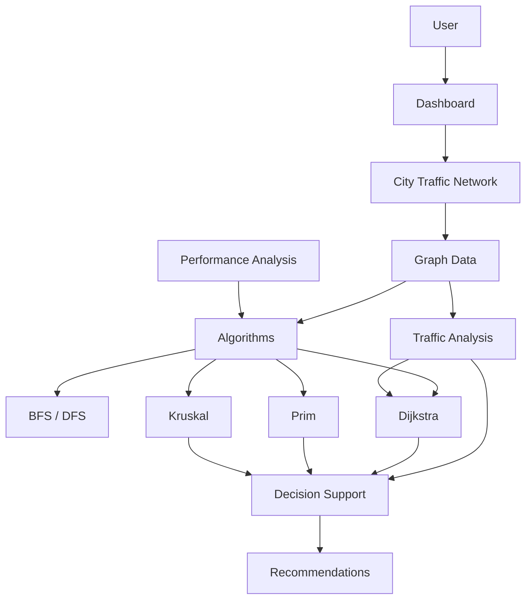

# System Architecture

## Overview

The application is a client-side Next.js dashboard. It keeps the city-road graph in one typed data module and calls reusable TypeScript algorithms to drive visualization, analysis, planning, performance measurement, and recommendations.

## Data Flow

1. `data/trafficGraph.ts` provides the single source of truth for nodes and roads.
2. `types/trafficGraph.ts` defines `TrafficGraph`, `GraphNode`, `GraphEdge`, traffic condition, distance, and multiplier contracts.
3. `app/page.tsx` owns shared dashboard state for selected source/destination, route results, MST results, traversal state, and focused traffic roads.
4. `CityTrafficNetwork` renders the graph using SVG and applies route, MST, traversal, and focused-road states without duplicating the graph.
5. Algorithm modules receive the graph and return typed results.
6. Analysis, planning, performance, and decision-support components render those results for the user.

## Directory Roles

| Directory | Role |
| --- | --- |
| `app/` | Next.js App Router entry point, layout, dashboard composition, and global styling |
| `algorithms/` | Reusable BFS, DFS, Dijkstra, MST, traffic analysis, performance, and decision-support logic |
| `components/` | Interactive dashboard modules and SVG graph visualization |
| `data/` | Current simulated city graph data |
| `types/` | Shared TypeScript graph contracts |
| `public/` | Static assets exposed by Next.js |

## Core Modules

### City Traffic Network

`components/CityTrafficNetwork.tsx` renders the current graph and supports source/destination selection. It preserves traffic-condition road styling while displaying traversal, Dijkstra route, MST, and selected-road highlights.

### Algorithms

- `algorithms/traversal.ts`: BFS and DFS network traversal.
- `algorithms/dijkstra.ts`: shortest-distance and simulated traffic-aware routing.
- `algorithms/mst.ts`: Prim and Kruskal infrastructure planning.
- `algorithms/trafficAnalysis.ts`: congestion metrics and road ranking.
- `algorithms/performance.ts`: browser-local measurement of existing algorithms.
- `algorithms/decisionSupport.ts`: deterministic commuter and administrator recommendations.

### Traffic Analysis and Decision Support

Traffic Analysis reads graph conditions and multipliers to calculate congestion and rank roads. Decision Support consumes traffic analysis, Dijkstra outputs, and optional MST results to produce deterministic messages. No AI service, live API, database, or backend is involved.

### Performance Analysis

`components/PerformanceAnalysis.tsx` runs the existing BFS, DFS, Dijkstra, Prim, and Kruskal functions through `algorithms/performance.ts`. It uses browser `performance.now()` for local execution measurements. These timings support methodology discussion only and are not city-scale benchmark data.

## State and Reset Behavior

Route endpoint state is shared by the route form and the graph. Resetting the network selection clears selected endpoints, Dijkstra route output, MST output/highlighting, focused traffic-road state, and traversal visualization. Resetting Performance Analysis only clears benchmark output and does not change unrelated dashboard state.
